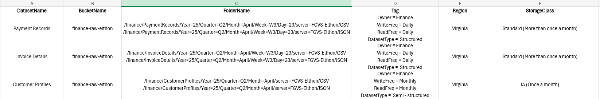
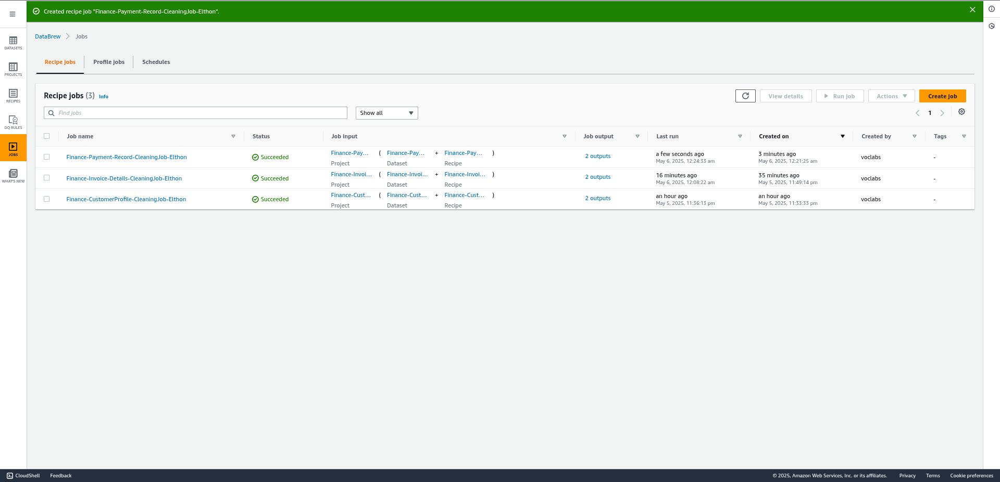

# **Project Description**
UCW Finance Operation team wants to know the patterns in delayed payments that affect cashflow. We go throught Payment Records, Invoice Details and Customer Profiles to analyze payment behavior and identify causes of payment delays impacting cash flow. We created a DAP (Data Analitic Platform).

## **Metodology**
This project was developed using three steps: Analysis, Design and Implementation.

### **1. Analysis**
In this step we review the root cause of this problem where we could identified some causes related to our main problem:

After that, we reviewed the datasets that is close related to our problem: 

The dataset includes transactional data from UCW Finance Operation Team over the past years, containing the following key features:

- **Payment Records:**
    - **PaymentID:** Unique identifier for each payment
    - **CustomerID:** Identification number for each customer
    - **InvoiceID:** Identification number for each invoice
    - **PaymentDate:** Date the transaction
    - **AmountPaid:** Amount paid in the transaction

- **Invoice Details:**
    - **InvoiceID:** Identification number for each invoice
    - **CustomerID:** Identification number for each customer
    - **InvoiceDate:** Date the invoice
    - **DueDate:** Due date of the invoice
    - **TotalAmount:** Total amount of the invoice

- **Customer Profiles:**
    - **CustomerID:** Identification number for each customer
    - **CustomerName:** Firstname and lastname of the customer
    - **CreditTerms:** It contains information about credit terms like *Due on Receipt, Net 30 or Net 60*

It time to see how we plan to clean our dataset:

Final step for analysis is enrich our dataset:

### **2. Design**
In this step we design our solution for building our DAP. First we have to design our datalake for our dataset:

It is time to design our DAP architecture to store, clean and enrich our datasets. We planned to use these services:

### **3. Implementation**
We started creating our buckets in S3 called *finance-raw-elthon*, for our raw datasets and one folder for each dataset:

Next, we created some projects in AWS Glue Databrew to clean each dataset:

Besides, we created one cleaning job for each dataset:

To store our cleaned dataset, we created a new bucket called *finance-cln-elthon*.

**Payment Records:**

We also create a profiling job to load and analyze the payment record dataset:

And these were the results after running the profiling and cleaning jobs:

**Invoice Details:**

**Customer Profiles:**

## **Tools and Technologies**
    
## **Cloud Foundation**
